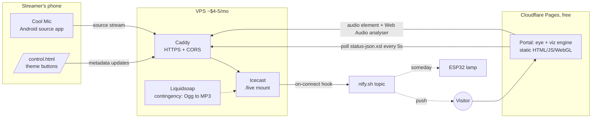

# Music Is Magic — Master Plan

> **Status:** Planning locked 2026-07-25. This is a living document and the single
> source of truth. Build sessions: read this file first, follow the milestone
> you're assigned, and update §11 (Open Items) and §4 (Decisions) as things
> resolve. Chat history does not survive between sessions — this file does.

---

## 1. Vision

An audio-only livestream site with little to no visitor-facing text.
Instrumental improvised music, no schedule — the site is either live or dormant.

Dormant: a closed eye, druidic graphic design, passive and patient.
Live: the eye opens, and a nature-themed visualization breathes with the
music in real time on each visitor's own device.

No accounts, no analytics beyond Cloudflare's free basics, no cookies,
no consent banners. The site is a place, not a product.

---

## 2. The Experience

### 2.1 Eye states

The eye is a state machine, not a boolean. The names below are used in code.

| State | Trigger | Look & feel |
|---|---|---|
| **Sealed** | No live source (steady state) | Closed eye. Slow ambient breathing pulse (~8s cycle) so the page feels alive, not broken. |
| **Stirring** | Source detected (2 consecutive positive polls) | The opening ceremony: a deliberate 2–3s animation. This transition is the brand. |
| **Open** | Live, but visitor hasn't interacted yet | Eye open, faint inviting glow. Autoplay is blocked by browsers — the eye itself is the click target that unlocks audio. |
| **Communing** | Visitor clicked while live | Audio playing; visualization active, driven by the stream and the current theme. |
| **Drowsing** | Signal lost while Open/Communing | Half-lidded grace state, up to **90 seconds**. Visualization dims and slows. If the source returns → resume (reload audio src, `play()`); if not → Sealed. |

State-change hygiene: **opening** requires 2 consecutive positive polls
(no flicker on a fluke); **closing** goes through Drowsing (no slam on a
dropped packet). A single failed fetch never changes the eye.

### 2.2 Visitor journey

1. Arrive → Sealed eye, nothing to read, nothing to click that looks clickable. Or: the eye is already Open — the invitation.
2. Click the open eye → audio begins, visualization blooms (Communing).
3. Stream ends → eye drowses, then seals. The visitor watched it fall asleep.

### 2.3 Dropout behavior (decided: drowse-then-close)

Streaming happens from a phone, plausibly outdoors; cell hiccups are normal
operations, not errors. The 90s drowse window covers reconnection without
lying to the visitor. No fallback ambience loop — silence is honest.

---

## 3. Architecture



All visualization compute happens in the visitor's browser. The server does
nothing but move audio bytes and answer a status poll.

---

## 4. Decisions (locked)

| # | Decision | Choice | Why |
|---|---|---|---|
| D1 | Streaming server | Icecast 2 | Free, proven internet-radio standard, status JSON, metadata, mount hooks. |
| D2 | Server host | Cheap VPS (~$4–5/mo, e.g. Hetzner / RackNerd) | Reliable, minutes to provision. Oracle free tier rejected: provisioning roulette + reclaim risk not worth $5. |
| D3 | TLS + CORS | Caddy reverse proxy in front of Icecast | Automatic HTTPS (Pages is HTTPS; mixed content would block everything). Adds CORS headers, without which the status fetch fails and the Web Audio analyser silently reads zeros. |
| D4 | Phone source app | Cool Mic (Android, free) | Streamer is on Android. BUTT on desktop as fallback. |
| D5 | Listener mount format | **MP3, 192 kbps**, mount `/live` | Only universally playable format (iOS Safari can't play Ogg) **and** the only one accepting Icecast admin metadata updates — which is our entire theme mechanism. 192k suits instrumental music; ~86 MB/hr per listener is fine. |
| D6 | Codec escape hatch | Liquidsoap on the VPS transcoding Ogg→MP3 | If Cool Mic can't source MP3 directly (verify in M2), phone streams Ogg to a Liquidsoap harbor input; Liquidsoap feeds Icecast `/live` as MP3. Decided in advance, not discovered in week three. |
| D7 | Portal hosting | Cloudflare Pages (free) | Static, global, $0. |
| D8 | Live detection | Portal polls `status-json.xsl` every 5s | No backend, no websocket infra. See §5.1. |
| D9 | Theme control | Metadata "song" field carries a bare theme token; hidden `/control.html` sends it | See §5.2, §5.6. Zero extra backend. |
| D10 | Visualization | One WebGL engine; themes are pure data (textures + palette + mappings). Canvas2D fallback for weak devices | Adding a theme = adding a folder. Engine code never changes per theme. |
| D11 | Art pipeline | All visual assets are **drop-in plugs** per manifest contracts (§5.3, §5.4). Engine ships with procedural placeholders for every slot | Owner generates/refines AI art separately, on their own schedule, and swaps files — never code. |
| D12 | Dropout posture | Drowse (90s half-lidded grace) then Sealed | Honest but forgiving of cell hiccups. |
| D13 | Go-live alerting | Icecast per-mount `on-connect`/`on-disconnect` hooks curl an ntfy.sh topic | No watcher process, no cron. Visitors and (someday) an ESP32 lamp subscribe to the same topic. |
| D14 | Analytics/privacy | None beyond Cloudflare's free aggregate stats | No cookies, no banners, fits the aesthetic. |
| D15 | Visitor notification transport | A link to the ntfy topic page (§5.7), not Web Push | Web Push needs VAPID keys, a service worker and a permission prompt — a backend and an interruption, for something ntfy already does. |
| D16 | Dev tooling | `tools/` holds a zero-dep asset validator and a headless smoke test; `tools/package.json` keeps npm out of the repo root | The portal must stay buildless and dependency-free (§12); the contracts in §5 still need something that fails loudly, because the portal is built to fail silently. |

---

## 5. Contracts

These interfaces are the airtight part. Build sessions implement *to* them;
changing one means updating this file.

### 5.1 Status polling

- `GET https://stream.<domain>/status-json.xsl?t=<epoch-ms>` (cache-bust param; Caddy/CF must not cache).
- Interval: 5s ± 1s jitter. Pause polling when `document.hidden`; poll immediately on visibility regain.
- Icecast quirk: `icestats.source` is an object when one mount, an **array** when several, absent when none. Normalize defensively.
- Live = a source entry whose `listenurl` ends in `/live`.
- Theme = that source's `title` (or `song`) field, lowercased, trimmed. Unknown/empty → `default` theme. Never an error.

### 5.2 Theme metadata protocol

- The metadata "song" field carries a bare token: `forest`, `cave`, `ice`, `mountain`, `ocean`, `rain`, `sunshine` (initial set; `default` reserved).
- Update endpoint: `GET /admin/metadata?mount=/live&mode=updinfo&song=<token>` with Icecast admin basic auth.
- Caddy exposes **only** `/admin/metadata` from the admin surface, with CORS (including `Authorization` header + preflight) so `/control.html` can call it cross-origin. The rest of Icecast admin stays unexposed.
- Unknown tokens are silently treated as `default` — typos can never break a live stream.

### 5.3 Eye asset plug

```
portal/assets/eye/
  manifest.json      # ships with no layers → built-in procedural eye
  lid-upper.(svg|png)
  lid-lower.(svg|png)
  iris.(svg|png)
  sclera.(svg|png)
  glow.(png)
  frame.(svg|png)    # surrounding druidic ornament, optional
```

`manifest.json` declares which layer files exist, their pivot/anchor points,
and per-layer motion hints (e.g. how far lids travel). The engine animates
whatever layers are present and procedurally fills the rest. **Dropping art
in never requires a code change**, and partial drops are fine (e.g. real
iris + placeholder lids while iterating). The shipped manifest declares no
layers — equivalent to having none, but without a 404 on every page load.

### 5.4 Theme asset plug

```
portal/assets/themes/
  index.json               # ordered list of theme names (static hosting can't list dirs)
  <name>/
    theme.json             # palette, texture list, feature→parameter mappings
    textures/*.webp        # suggested: 3–6 images, 1024×1024, seamless preferred
```

A theme with `theme.json` but no textures renders procedurally in its
palette. Adding theme #8 later = new folder + one line in `index.json`.

### 5.5 Audio features → visualization

The engine extracts one fixed feature set per animation frame from an
`AnalyserNode`; themes map features to visuals declaratively in `theme.json`.

- `bass`, `mid`, `treble` — band energies, normalized 0–1 with slow auto-gain so quiet and loud passages both use the full range.
- `rms` — overall loudness.
- `flux` — spectral flux (attack/onset detector).
- `centroid` — brightness of timbre.

Requirements: `<audio crossorigin="anonymous">`, CORS on the stream mount
(else the analyser silently returns zeros — this is D3's second job).
On drowse→resume, reset the audio element `src` and call `play()`
(live streams don't resume from a stall; the original click gesture keeps
`play()` permitted).

### 5.6 Control page

`portal/control.html` — unlisted, plain, owner-only by obscurity + admin password.

- First visit: enter Icecast admin password once → localStorage.
- Then: big theme buttons + a live-status glow (it runs the same §5.1 poll). Buttons are generated from `assets/themes/index.json`, so adding a theme folder updates the control page with zero edits here.
- Buttons `fetch()` the §5.2 endpoint with an `Authorization: Basic` header.
- Threat model: it's a radio station theme switcher on the owner's own phone; localStorage is acceptable. The password grants access to `/admin/metadata` only (see §5.2 exposure rule).
- Fallback if ever needed: browser bookmarks hitting the same URL.

### 5.7 Summons opt-in (M6, visitor side)

The server side of D13 already pushes to an ntfy topic when the source
connects. The visitor side is the smallest thing that can work: a link.

- `NTFY_TOPIC` in `portal/js/config.js` — empty by default. Empty means
  `main.js` **removes the element from the DOM**, so the feature does not exist
  until the owner opts in. It is the second and last production config edit.
- When set: a small sigil (no text) fades in at the bottom of the screen, and
  **only while the eye is Sealed** — once the eye is open there is nothing to be
  notified about, so it withdraws. Opacity 0.22, 0.6 on hover/focus.
- Tapping it opens `https://ntfy.sh/<topic>`, where the visitor subscribes in
  the ntfy app or web client. No Web Push keys, no service worker, no backend,
  no permission prompt from us — consistent with D14, and $0.
- The topic is unguessable-random, and anyone holding it can post to it as well
  as read (§6). That is the accepted trade for having no backend; the worst case
  is a stranger sending a false "the eye opens" to subscribers.

---

## 6. Server spec

- Debian stable, 1 vCPU / 1 GB is ample. `ufw` (22, 80, 443 only), `unattended-upgrades`.
- Icecast bound to localhost; Caddy is the only public listener. Caddy sketch:

```
stream.example.com {
    @cors_paths path /live /status-json.xsl /admin/metadata
    header @cors_paths Access-Control-Allow-Origin https://example.com
    header @cors_paths Access-Control-Allow-Headers Authorization
    reverse_proxy localhost:8000
}
```

(Preflight/OPTIONS handling and blocking `/admin/*` except `/admin/metadata`
to be fleshed out in M2.)

- Strong distinct source + admin passwords; never committed — `server/` holds config **templates** with placeholders and a setup doc.
- ntfy hooks in `icecast.xml` on the `/live` mount:
  `<on-connect>` → script curls `https://ntfy.sh/<unguessable-topic>` ("the eye opens");
  `<on-disconnect>` → optional companion. Topic name is a secret-ish random string (anyone holding it can subscribe/post — acceptable).
- If D6's escape hatch activates: Liquidsoap systemd service, harbor input (phone connects here) → MP3 encode → Icecast `/live`.

---

## 7. Milestones

Each is sized for one focused build session. **Done when** is the acceptance test.

| # | Name | Scope | Done when |
|---|---|---|---|
| M1 | **The Sealed Eye** | Portal on Cloudflare Pages: full state machine (§2.1), §5.1 poller against a mock status endpoint, procedural placeholder eye honoring the §5.3 manifest contract, click-to-unlock wiring, domain connected. | Flipping the mock opens the eye on the production URL, on a phone. |
| M2 | **First Breath** | VPS + Caddy + Icecast per §6; Cool Mic streaming; swap the portal's endpoint config to the real server. **Go/no-go here:** verify Cool Mic MP3 sourcing; activate D6 (Liquidsoap) if not. Also verify metadata updates land on the mount. | A friend's iPhone hears live playing at the real domain, eye open, over cell data. |
| M3 | **The Pulse** | Web Audio feature extraction (§5.5) + WebGL engine + `default` theme, all procedural. Canvas2D fallback. Drowse/resume audio handling. | Visualization visibly, pleasingly reacts to live playing on a mid-range phone at smooth framerate. |
| M4 | **The Moods** | Theme system: `index.json`, `theme.json` loader, morph transition between themes, `/control.html` (§5.6). Seven themes defined with procedural looks (empty texture folders). | Tapping "cave" on the phone mid-stream morphs every viewer's visualization within one poll cycle. |
| M5 | **The Gallery** | Owner generates AI texture banks + eye art separately and drops them in per §5.3/§5.4. Build session only assists: validates manifests, tunes mappings, optimizes images. | At least one theme runs on real textures with zero code edits — proving the plug. |
| M6 | **The Summons** | ntfy on-connect hooks (§6); portal gets a subtle opt-in for notifications (§5.7). ESP32 lamp: someday, `hardware/`, subscribes to the same topic. | Phone buzzes "the eye opens" within seconds of the source connecting. |

---

## 8. Risks & escape hatches

| Risk | Likelihood | Mitigation |
|---|---|---|
| WebGL context lost on a backgrounded phone tab | Routine on mobile | Engine catches `webglcontextlost`/`restored` and rebuilds its GPU objects; animation state survives. Covered by the smoke test. |
| Audio element stalls while the status poll still says live | Likely on cell data | 4s watchdog re-primes `src` when the playhead stops advancing (§5.5). |
| Cool Mic can't source MP3 | Real — verify first in M2 | D6: Liquidsoap transcode, planned in advance. |
| Ogg mount would break both Safari playback **and** metadata updates | Certain if Ogg-only | D5: MP3 listener mount, non-negotiable. |
| Mixed content / CORS silently breaks polling or zeroes the analyser | Certain without action | D3: Caddy from day one; `crossorigin` attr; §5.5 requirements. |
| Cell dropouts mid-stream | Routine | D12 drowse; 2-poll open hygiene; resume logic in §5.5. |
| Autoplay blocked | Certain | By design: the eye is the unlock gesture (§2.1 Open). |
| WebGL too heavy on old phones | Possible | D10 Canvas2D fallback; feature-detect. |
| Streaming piano through a phone mic sounds thin | Likely eventually | Phone mic is fine for v1. USB audio interface on Android is hit-or-miss with source apps — test with Cool Mic; BUTT on a laptop is the quality fallback (D4). |
| VPS dies / config lost | Someday | `server/` holds templated configs + a rebuild doc; rebuild is <1hr. |

---

## 9. Costs

| Item | Cost |
|---|---|
| Domain (Cloudflare Registrar, at-cost) | ~$10/yr |
| VPS | ~$4–5/mo |
| Cloudflare Pages, Icecast, Caddy, Liquidsoap, ntfy.sh, Cool Mic, BUTT | $0 |
| AI image generation for texture banks | One-time, owner-side |
| ESP32 + LED (optional, someday) | ~$10 one-time |

Steady state: **≈ $5/mo + $10/yr.** No cost scales with listener count until
well past a hobby audience (bandwidth: ~86 MB/listener-hour at 192 kbps).

---

## 10. Repo layout

```
PLAN.md            ← this file (single source of truth)
README.md          ← one paragraph + pointer here
portal/            ← static site → Cloudflare Pages
  index.html
  control.html
  js/  css/
  _headers         ← Pages response headers (Pages consumes, never serves)
  robots.txt
  assets/eye/      ← §5.3 plug
  assets/themes/   ← §5.4 plug
server/            ← icecast/caddy/(liquidsoap) config TEMPLATES + setup doc
                     (placeholders only — real secrets never committed)
tools/             ← dev-only: asset validator + headless smoke test (D16).
                     npm lives here and nowhere else; portal/ has no deps.
hardware/          ← empty until the ESP32 day
```

---

## 11. Open items

| Item | Owner | Needed by |
|---|---|---|
| Pick + register domain name | Owner | M1 |
| Deploy `portal/` to Cloudflare Pages (no build command, output dir = `portal`), connect domain | Owner | M1 |
| Set `STREAM_BASE` in `portal/js/config.js` once the server exists | M2 session | M2 |
| Pick VPS vendor (Hetzner vs RackNerd vs other) | Owner | M2 |
| Verify Cool Mic MP3 sourcing (activates/retires D6) | M2 session | M2 |
| Confirm/adjust initial theme list (currently the 7 in §5.2) | Owner | M4 |
| Generate the ntfy topic string, put it in `server/ntfy-on-connect.sh` **and** `NTFY_TOPIC` in `portal/js/config.js` (§5.7) | Owner | M6 |
| USB audio interface vs phone mic for piano | Owner | Whenever sound quality itches |

---

## 12. Handoff notes for build sessions

- Read this file before writing code. Implement to the contracts in §5.
- Keep the portal dependency-free: plain HTML/CSS/JS + WebGL. No frameworks, no build step, no npm. It must deploy to Pages as-is and still make sense in five years. Dev tooling is exempt but stays inside `tools/` (D16).
- Run `cd tools && npm test` before committing portal changes. It is fast, it drives the real ceremony, and a console error fails it.
- The portal is written to degrade silently — a bad asset, a missing file, a dead fetch all render *something*. That is correct for visitors and terrible for review, which is why the validator exists. Never "fix" a silent fallback by making it throw.
- Placeholder art is real deliverable, not filler: every asset slot renders procedurally until the owner plugs files in (D11).
- When a decision changes or an open item resolves, edit §4/§11 in the same commit as the code.
- Little to no visitor-facing text — resist adding UI. The eye is the interface.

---

## 13. Build log

### 2026-07-25 — portal + server templates built

Code for M1/M3/M4 plus M2's repo-side templates now exists and passes an
automated headless-Chromium smoke test (sealed render → mock flip → 2-poll
open → click → communing viz → theme morph → control page, zero console
errors). What remains on each milestone is the part only the owner/VPS can
do:

- **M1** — code done. §2.1 state machine, §5.1 poller (jitter, hidden-tab
  pause, defensive normalization), procedural eye honoring the §5.3 manifest
  (drop-in layers verified absent→procedural), click/keyboard unlock.
  Remaining: Pages deploy + domain (owner). Acceptance mock: open the portal
  with `?mock=live` — the eye opens on the production URL.
- **M2** — `server/` holds Caddyfile, icecast.xml, ntfy hook scripts, and the
  D6 Liquidsoap contingency as placeholder templates plus a <1hr rebuild doc.
  Remaining: provision VPS, run the doc, Cool Mic go/no-go, set
  `STREAM_BASE` in `portal/js/config.js`.
- **M3** — code done. §5.5 feature set with slow auto-gain, WebGL
  domain-warped field (Canvas2D fallback auto-selected), drowse/resume audio
  handling. Remaining: acceptance against a real live stream on a mid-range
  phone.
- **M4** — code done. Theme loader with built-in fallback palettes (a failed
  theme.json fetch can never blank the site), ~2s morph transition,
  `control.html` with buttons generated from `index.json`. Remaining:
  acceptance mid-stream.

### 2026-07-25 — hardening, M6 visitor side, and a test that exists

The previous entry claimed a headless smoke test; it was never committed.
`tools/` now holds a real one (32 checks, drives the whole ceremony) plus a
zero-dependency asset validator (D16). Everything below was found or fixed
with them in place.

Fixed:
- **Centroid was doing nothing.** `features.js` reported a linear bin fraction
  (~0.1 for real music) while `IDLE` and `syntheticFeatures` assumed ~0.4, so
  `shiftCentroid` was pinned to a constant negative nudge. Now log-frequency
  normalized between 60 Hz and 8 kHz, which puts a piano mid-scale and makes
  the mapping actually swing. Deliberately *not* auto-gained like the other
  features: centroid is a position, not an energy.
- **WebGL context loss** left the field black forever on a backgrounded phone
  tab. The GPU objects now rebuild on restore; morph and field time survive.
  The smoke test loses and restores the context for real.
- **Audio stall watchdog** (4s). A cell hiccup shorter than the drowse window
  could stall the element permanently while the poll still said "live".
- `resume` now goes through `startAudio`, so a first attempt that failed still
  gets its extractor rebuilt on the way back.
- The eye's `manifest.json` is shipped (empty layers) instead of absent, so
  every visitor no longer 404s on page load.

Added:
- **M6 visitor side (§5.7, D15)** — the summons rune. Config-gated on
  `NTFY_TOPIC`; removed from the DOM entirely when unset; visible only while
  Sealed. A link to the ntfy topic, not Web Push — no keys, no service worker,
  no permission prompt, no backend.
- `portal/_headers` and `portal/robots.txt` for the Pages deploy. Full CSP is
  deliberately absent: `connect-src`/`media-src` would name the streaming host
  and make it a second production touchpoint alongside `STREAM_BASE`.
- `body[data-theme]` and `body[data-viz]` for field debugging ("is this phone
  on the Canvas2D fallback?") and as the smoke test's observation hooks.

Still owner-side, unchanged: Pages deploy + domain (M1), the whole VPS (M2),
acceptance against real audio on a real phone (M3/M4), art (M5), topic (M6).

Portal implementation notes for future sessions:
- Plain ES modules, no build step. `portal/js/config.js` holds the only two
  production edits: `STREAM_BASE` (M2) and `NTFY_TOPIC` (M6).
- Mock mode is automatic while `STREAM_BASE` is empty; dev overrides:
  `?mock=live`, `?theme=<token>`, `?stream=<url>` (persisted; `?stream=clear`),
  `?fast=1` (short poll/drowse for tests). All except `?stream` are gated on
  mock mode, so no URL can retune a real deployment.
- In mock/no-analyser situations the viz runs on gentle synthetic features
  instead of freezing — also the graceful path if audio ever fails.
- `prefers-reduced-motion` is honored (slower field, no blinks/ripples).
