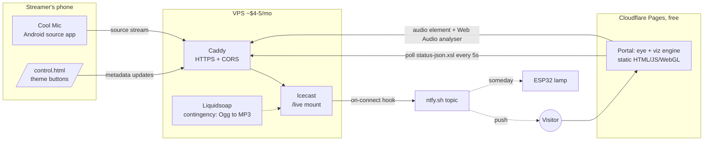

# Music Is Magic — Master Plan

> **Status:** Planning locked 2026-07-25. This is a living document and the single
> source of truth. Build sessions: read this file first, follow the milestone
> you're assigned, and update §11 (Open Items) and §4 (Decisions) as things
> resolve. Chat history does not survive between sessions — this file does.

---

## 1. Vision

An audio-only livestream site with little to no visitor-facing text.
Instrumental improvised music, no schedule — the site is either live or dormant.

Dormant: a closed eye, druidic graphic design, passive and patient.
Live: the eye opens, and a nature-themed visualization breathes with the
music in real time on each visitor's own device.

No accounts, no analytics beyond Cloudflare's free basics, no cookies,
no consent banners. The site is a place, not a product.

---

## 2. The Experience

### 2.1 Eye states

The eye is **carved, not drawn**: a stone plate — golem, idol — with a
lens-shaped aperture cut through it, in a dark room. Nothing about it is
anatomical; a stylized human eye reads as cartoon at this scale, and stone
does not blink.

The aperture is a **window onto the visualization**, not a decoration over it.
Where an iris and pupil would be, there is the moving field. Sealed, there is
nothing to see but stone; open, you see what is inside the eye. That inversion
is the design — everything else follows from it, including the fact that light
spilling onto the surrounding stone is the only place a theme colors anything
outside the aperture.

The eye is a state machine, not a boolean. The names below are used in code.

| State | Trigger | Look & feel |
|---|---|---|
| **Sealed** | No live source (steady state) | Stone, and a carved slit where the aperture will part. Nothing inside. The life-sign is a slow ember in the seam (~8s cycle) rather than movement — the page must feel patient, not broken, and stone that breathes stops being stone. |
| **Stirring** | Source detected (2 consecutive positive polls) | The opening ceremony: the stone parts over a deliberate 2–3s, and the field appears inside. This transition is the brand. |
| **Open** | Live, but visitor hasn't interacted yet | Aperture open on a dim field, faint light spilling onto the stone. Autoplay is blocked by browsers — the eye itself is the click target that unlocks audio. |
| **Communing** | Visitor clicked while live | Audio playing; the field inside the aperture is driven by the stream and the current theme, and the aperture widens slightly with the low end. |
| **Drowsing** | Signal lost while Open/Communing | The aperture narrows to a slit, up to **90 seconds**. The field dims and slows. If the source returns → resume (reload audio src, `play()`); if not → Sealed. |

State-change hygiene: **opening** requires 2 consecutive positive polls
(no flicker on a fluke); **closing** goes through Drowsing (no slam on a
dropped packet). A single failed fetch never changes the eye.

### 2.2 Visitor journey

1. Arrive → Sealed eye, nothing to read, nothing to click that looks clickable. Or: the eye is already Open — the invitation.
2. Click the open eye → audio begins, visualization blooms (Communing).
3. Stream ends → eye drowses, then seals. The visitor watched it fall asleep.

### 2.3 Dropout behavior (decided: drowse-then-close)

Streaming happens from a phone, plausibly outdoors; cell hiccups are normal
operations, not errors. The 90s drowse window covers reconnection without
lying to the visitor. No fallback ambience loop — silence is honest.

---

## 3. Architecture



All visualization compute happens in the visitor's browser. The server does
nothing but move audio bytes and answer a status poll.

---

## 4. Decisions (locked)

| # | Decision | Choice | Why |
|---|---|---|---|
| D1 | Streaming server | Icecast 2 | Free, proven internet-radio standard, status JSON, metadata, mount hooks. |
| D2 | Server host | Cheap VPS (~$4–5/mo, e.g. Hetzner / RackNerd) | Reliable, minutes to provision. Oracle free tier rejected: provisioning roulette + reclaim risk not worth $5. |
| D3 | TLS + CORS | Caddy reverse proxy in front of Icecast | Automatic HTTPS (Pages is HTTPS; mixed content would block everything). Adds CORS headers, without which the status fetch fails and the Web Audio analyser silently reads zeros. |
| D4 | Phone source app | Cool Mic (Android, free) | Streamer is on Android. BUTT on desktop as fallback. |
| D5 | Listener mount format | **MP3, 192 kbps**, mount `/live` | Only universally playable format (iOS Safari can't play Ogg) **and** the only one accepting Icecast admin metadata updates — which is our entire theme mechanism. 192k suits instrumental music; ~86 MB/hr per listener is fine. |
| D6 | Codec escape hatch | Liquidsoap on the VPS transcoding Ogg→MP3 | If Cool Mic can't source MP3 directly (verify in M2), phone streams Ogg to a Liquidsoap harbor input; Liquidsoap feeds Icecast `/live` as MP3. Decided in advance, not discovered in week three. |
| D7 | Portal hosting | Cloudflare Pages (free) | Static, global, $0. |
| D8 | Live detection | Portal polls `status-json.xsl` every 5s | No backend, no websocket infra. See §5.1. |
| D9 | Theme control | Metadata "song" field carries a bare theme token; hidden `/control.html` sends it | See §5.2, §5.6. Zero extra backend. |
| D10 | Visualization | One WebGL engine; themes are pure data (palette + params + **motif weights** + mappings + textures). Canvas2D fallback for weak devices | Adding a theme = adding a folder. Engine code never changes per theme. Motifs (§5.4) are how a theme gets character without breaking that: the engine holds the library, the theme picks from it. |
| D11 | Art pipeline | All visual assets are **drop-in plugs** per manifest contracts (§5.3, §5.4). Engine ships with procedural placeholders for every slot | Owner generates/refines AI art separately, on their own schedule, and swaps files — never code. |
| D12 | Dropout posture | Drowse (90s half-lidded grace) then Sealed | Honest but forgiving of cell hiccups. |
| D13 | Go-live alerting | Icecast per-mount `on-connect`/`on-disconnect` hooks curl an ntfy.sh topic | No watcher process, no cron. Visitors and (someday) an ESP32 lamp subscribe to the same topic. |
| D14 | Analytics/privacy | None beyond Cloudflare's free aggregate stats | No cookies, no banners, fits the aesthetic. |
| D15 | Visitor notification transport | A link to the ntfy topic page (§5.7), not Web Push | Web Push needs VAPID keys, a service worker and a permission prompt — a backend and an interruption, for something ntfy already does. |
| D17 | The eye's form | Carved stone (golem/idol) with a lens aperture; the visualization lives **inside** the aperture, not behind the eye | A stylized human eye — sclera, iris, lashes — reads as cartoon at full-screen scale. And a field behind a floating eye is wallpaper; a field seen *through* carved stone is the thing the site is about. Reverses the first implementation. See §2.1. |
| D16 | Dev tooling | `tools/` holds a zero-dep asset validator and a headless smoke test; `tools/package.json` keeps npm out of the repo root | The portal must stay buildless and dependency-free (§12); the contracts in §5 still need something that fails loudly, because the portal is built to fail silently. |
| D18 | Broadcast build | A **second page in the same portal** (`broadcast.html`), not a fork and not a second repo. It reuses `eye.js`, `viz.js`, `themes.js`, `state.js`, `features.js` unchanged and swaps only its audio source and its liveness source | The shader and the motif library are the expensive assets. Duplicating them means every future mood, every tuning pass, and every bug fix happens twice by hand and then drifts. The engine was already source-agnostic in the two places that mattered — `FeatureExtractor` takes an `AnalyserNode`, and the state machine takes poll results — so the split is config, not code. |
| D19 | Broadcast control transport | ntfy.sh, publish by POST and subscribe by `EventSource`, on a topic **distinct from** D13's summons topic and **never committed** | Icecast metadata is the website's bus (D9) and there is no Icecast in a YouTube broadcast. A Cloudflare Worker + KV was the first candidate and was rejected: KV is eventually consistent at up to 60s, and a mood button that might take a minute is a broken mood button. ntfy is already this project's push transport, is free, needs no account and no backend, pushes in real time, and its threat model is one §5.7 already accepts. |
| D20 | Broadcast video path | OBS Studio: Browser Source preferred, Window Capture as the fallback, and YouTube's **stream key** rather than its webcam flow | A web page cannot register itself as an OS camera device on any browser — "feed the eye in as a webcam" necessarily means a virtual camera driver, and OBS's is the free one. Once OBS is installed anyway, RTMPS costs one *fewer* moving part than the virtual camera and gives 1080p instead of the webcam flow's 720p. The webcam flow still works and is documented; it is just not the default. |

---

## 5. Contracts

These interfaces are the airtight part. Build sessions implement *to* them;
changing one means updating this file.

### 5.1 Status polling

- `GET https://stream.<domain>/status-json.xsl?t=<epoch-ms>` (cache-bust param; Caddy/CF must not cache).
- Interval: 5s ± 1s jitter. Pause polling when `document.hidden`; poll immediately on visibility regain.
- Icecast quirk: `icestats.source` is an object when one mount, an **array** when several, absent when none. Normalize defensively.
- Live = a source entry whose `listenurl` ends in `/live`.
- Theme = that source's `title` (or `song`) field, lowercased, trimmed. Unknown/empty → `default` theme. Never an error.

### 5.2 Theme metadata protocol

- The metadata "song" field carries a bare token: `forest`, `cave`, `ice`, `mountain`, `ocean`, `rain`, `sunshine` (initial set; `default` reserved).
- Update endpoint: `GET /admin/metadata?mount=/live&mode=updinfo&song=<token>` with Icecast admin basic auth.
- Caddy exposes **only** `/admin/metadata` from the admin surface, with CORS (including `Authorization` header + preflight) so `/control.html` can call it cross-origin. The rest of Icecast admin stays unexposed.
- Unknown tokens are silently treated as `default` — typos can never break a live stream.

### 5.3 Eye asset plug

```
portal/assets/eye/
  manifest.json      # ships with no layers → built-in procedural eye
  plate.(svg|png)    # the stone face, aperture left transparent
  socket.(svg|png)   # carved rim + inner shadow, over the field's edge
  lid-upper.(svg|png)
  lid-lower.(svg|png)
  glow.(png)
  frame.(svg|png)    # surrounding druidic ornament, optional
```

`manifest.json` declares which layer files exist, the aperture the field is
clipped to, and per-layer motion hints (e.g. how far lids travel). The engine
animates whatever layers are present and procedurally fills the rest.
**Dropping art in never requires a code change**, and partial drops are fine.
The shipped manifest declares no layers — equivalent to having none, but
without a 404 on every page load.

There is no eyeball to author. See §2.1: the aperture is a window onto the
visualization, so the art is stone and the hole in it. `aperture: {w, h}`
(fractions of the shared square box) is the one value that must agree with
the art, since it decides where the field is clipped.

### 5.4 Theme asset plug

```
portal/assets/themes/
  index.json               # ordered list of theme names (static hosting can't list dirs)
  <name>/
    theme.json             # palette, texture list, feature→parameter mappings
    textures/*.webp        # suggested: 3–6 images, 1024×1024, seamless preferred
```

A theme with `theme.json` but no textures renders procedurally in its
palette. Adding theme #8 later = new folder + one line in `index.json`.

**Motifs.** A palette and four scalars only ever produced the same fog in
different colors, which is not a mood. So the engine compiles in a fixed
library of procedural motifs and a theme declares which ones it is made of:

| Motif | What it is | Used by |
|---|---|---|
| `rays` | shafts of light from above | sunshine, forest |
| `columns` | irregular vertical masses — trunks, formations | forest, cave, mountain |
| `dapple` | patches of light drifting at their own rate | forest, sunshine |
| `drips` | falling streaks | cave, rain |
| `facets` | crystal shards with a lit seam where they meet | ice |
| `caustics` | undulating light web | ocean |
| `crags` | angular rock planes, each catching the light its own way | mountain |
| `snow` | accumulation on whichever crag faces tilt skyward, below a snowline | mountain |

```json
"motifs": { "rays": 0.85, "dapple": 0.25 },
"params": { "gloss": 0.2, "slant": 0, "base": 1, "drift": 1, ... }
```

**`base` and `drift` are how a theme escapes the shared field.** Every theme
was built on the same domain-warped fbm at full strength and full speed, and
the result was that every theme was the same weather in a different colour —
"an identical fog effect suffusing everything", in the owner's words. `drift`
scales how fast that field evolves (0 freezes it) and `base` scales how much
it contributes at all (0 leaves a dark floor for the motifs to light). Both
default to 1, so a theme that says nothing looks exactly as it always did.

Note what freezing does *not* buy: a domain-warped fbm held still still looks
like smoke, because domain warping is what makes smoke. A theme that wants
rock has to say `crags`, lower `warp`, or both. `base`/`drift` get the fog out
of the way; they do not conjure a different material.

Weights are 0–1 and every theme carries every key (absent = 0), so morphing
between two themes is a plain lerp and a motif the target lacks fades out
rather than snapping off. Weight is not purely opacity: `drips` reads its own
weight as **density** — both how many lanes exist and how often a lane fires —
which is why a cave's occasional seep and hard rain are the same motif at two
settings rather than two motifs. Brightness stays nearly constant across that
range, or the sparse case just disappears. `gloss` hardens the palette ramp and
lets specular highlights through — the difference between weather and ice.
`slant` leans falling things off vertical: rain is wind-driven, a cave's seep
is not, and that is a separate axis from density — deriving it from the drips
weight would make heavier rain automatically windier, which is a different
claim about the world.

Params default (see `DEFAULT_PARAMS`) and are merged under every theme, so a
theme only names what it changes and morphing stays a plain lerp.

This keeps D10 intact: the motifs are engine code that never changes per
theme, and a theme is still only data. Adding a *motif* is an engine change
and should be rare — reserve it for a material the library genuinely lacks,
the way `snow` was. Adding a theme is still a folder.

Two findings worth not rediscovering:

- **Regular banding reads as electronic.** A horizontal-strata motif, however
  warped, looked like VHS scanlines inside a glowing aperture. It was replaced
  by `crags`. Anything with a repeating axis will have the same problem.
- **Clean voronoi reads as mosaic.** `crags` warps its lattice with noise
  before cells are found, and blends snow coverage with noise rather than
  taking it per-cell — otherwise the facets tile like cracked glass, which is
  `facets`' job, not rock's.
- **Check the sign of anything that moves.** `uv.y` increases upward, so
  `uv.y * k + t` falls and `uv.y * k - t` rises. Drips shipped rising and rays
  shipped lighting the aperture from below; neither is visible in a
  screenshot. There is no automated guard — the composited output is dominated
  by the base field's drift and the socket shading, so nothing measured from it
  isolates one motif's motion. Two attempts at a smoke check were too flaky to
  keep. Reason about the sign, then watch it move.

### 5.5 Audio features → visualization

The engine extracts one fixed feature set per animation frame from an
`AnalyserNode`; themes map features to visuals declaratively in `theme.json`.

- `bass`, `mid`, `treble` — band energies, normalized 0–1 with slow auto-gain so quiet and loud passages both use the full range.
- `rms` — overall loudness.
- `flux` — spectral flux (attack/onset detector).
- `centroid` — brightness of timbre.

Requirements: `<audio crossorigin="anonymous">`, CORS on the stream mount
(else the analyser silently returns zeros — this is D3's second job).
On drowse→resume, reset the audio element `src` and call `play()`
(live streams don't resume from a stall; the original click gesture keeps
`play()` permitted).

### 5.6 Control page

`portal/control.html` — unlisted, plain, owner-only by obscurity + admin password.

- First visit: enter Icecast admin password once → localStorage.
- Then: big theme buttons + a live-status glow (it runs the same §5.1 poll). Buttons are generated from `assets/themes/index.json`, so adding a theme folder updates the control page with zero edits here.
- Buttons `fetch()` the §5.2 endpoint with an `Authorization: Basic` header.
- Threat model: it's a radio station theme switcher on the owner's own phone; localStorage is acceptable. The password grants access to `/admin/metadata` only (see §5.2 exposure rule).
- Fallback if ever needed: browser bookmarks hitting the same URL.

### 5.7 Summons opt-in (M6, visitor side)

The server side of D13 already pushes to an ntfy topic when the source
connects. The visitor side is the smallest thing that can work: a link.

- `NTFY_TOPIC` in `portal/js/config.js` — empty by default. Empty means
  `main.js` **removes the element from the DOM**, so the feature does not exist
  until the owner opts in. It is the second and last production config edit.
- When set: a small sigil (no text) fades in at the bottom of the screen, and
  **only while the eye is Sealed** — once the eye is open there is nothing to be
  notified about, so it withdraws. Opacity 0.22, 0.6 on hover/focus.
- Tapping it opens `https://ntfy.sh/<topic>`, where the visitor subscribes in
  the ntfy app or web client. No Web Push keys, no service worker, no backend,
  no permission prompt from us — consistent with D14, and $0.
- The topic is unguessable-random, and anyone holding it can post to it as well
  as read (§6). That is the accepted trade for having no backend; the worst case
  is a stranger sending a false "the eye opens" to subscribers.

### 5.8 Control relay (M7, the broadcast bus)

On the website the moods travel *inside the stream*: `control.html` writes a
token into the Icecast mount's metadata and the portal reads it back out of
`status-json.xsl` (D9). That bus does not exist in a YouTube broadcast, so the
phone needs another way to reach the desktop. `portal/js/relay.js` is it,
behind one interface with three transports (D19):

| Mode | Transport | For |
|---|---|---|
| `local` | `BroadcastChannel` + a `localStorage` mirror | Same machine, two tabs. Zero setup, works offline. The test transport, and the way to try the design before committing to any infrastructure |
| `ntfy` | POST to publish, `EventSource` on `/sse` to subscribe | The real thing: phone to desktop, over the open internet |
| `none` | — | No channel; the broadcast page runs on its own defaults |

Message shape — a **partial** state, so a mood tap says nothing about whether
the eye should be open:

```json
{ "eye": "live" | "sealed", "theme": "<token>" }
```

Rules that are not negotiable:

- **Everything inbound is sanitized.** The topic is public to anyone holding
  it, and the theme token is concatenated into an asset path. `sanitize()`
  admits only `live`/`sealed` and `^[a-z0-9_-]{1,32}$`, drops the rest, and
  keeps the valid half of a half-valid message. Junk never half-applies.
- **A dead relay changes nothing**, exactly as a failed status poll changes
  nothing (§5.1). The eye holds its last state.
- **Catch-up is asymmetric.** On connect, the last cached message is replayed.
  Its *mood* is always adopted; its *eye state* only if the message is newer
  than `catchUpMaxAgeMs` (120s). A page reloaded mid-set comes back open; a
  page opened the next morning does not get woken by yesterday.
- **The code is typed into the page, not carried in the URL.** Both owner
  pages have a pairing field that restarts the relay in place, no reload. A
  query string turned out to be the least durable place to keep the one piece
  of configuration that matters: `serve` discards it on its `.html` redirect,
  and home-screen shortcuts and OBS browser sources lose it their own ways.
  `?topic=` still works as a shortcut and still persists; it is no longer the
  mechanism. `?topic=clear`, or an empty field, unpairs.
- **The relay topic is not the summons topic**, and it is **never committed**.
  `config.js` is served verbatim to every visitor, so a topic written there is
  a published password. Typed into the field, it lives in that browser only.

### 5.9 Broadcast page (M7)

`portal/broadcast.html` — the page OBS captures. Same eye, same shader, same
themes; three things differ, and one deliberately does not.

| | Website | Broadcast |
|---|---|---|
| Audio | Icecast stream via `<audio crossorigin>` | Local microphone via `getUserMedia` (`mic.js`) |
| Liveness | §5.1 status poll | The operator, over §5.8 |
| Audience gesture | The visitor clicks the eye to unlock audio | Nobody is watching; the page arms once and communes for itself |
| **State machine** | **`state.js`, unchanged** | **`state.js`, unchanged** |

That last row is the design. The eye's hygiene rules — two positive signals to
open, always drowse before sealing, a failed signal changes nothing — are the
brand, so the broadcast page reuses them verbatim by running a local ticker
that feeds `machine.onPoll()` from the relay's desired state. Nothing reaches
into the machine, and the ceremony is the same ceremony.

Specifics worth not rediscovering:

- **Never connect the mic to `ctx.destination`.** On the website that line is
  what makes sound audible; here it feeds the microphone back into the
  speakers. The analyser is a tap, not a monitor path — which is also why the
  page emits no audio at all and OBS must capture the mic itself.
- **Voice constraints ruin music.** `echoCancellation`, `noiseSuppression` and
  `autoGainControl` are all forced off: AGC pumps the dynamics flat, noise
  suppression eats sustained piano tails, and echo cancellation notches
  whatever it decides is feedback.
- **`deviceId` is matched with `exact`.** Silently landing on the laptop mic
  when the interface is unplugged is a failure you discover in the archive.
- **The mic keeps running through a seal**, unlike the website's audio element.
  There is no bandwidth to save, and a live level meter while the eye is shut
  is how you sound-check before waking it.
- **A refused microphone is not fatal.** It falls back to synthetic features so
  the eye still breathes. This is the most likely live failure — an OBS browser
  source without media permission — and a broadcast that looks alive beats a
  frozen frame.
- **The eye is scaled up** (`radius` 0.42 vs the website's 0.3). A 16:9 frame
  is sized off its height, so the website's composition strands the eye in a
  field of black.
- **The operator HUD must be able to vanish.** In Window Capture mode the page
  *is* the broadcast frame. It fades after 6s idle (taking the cursor with it),
  toggles on `h`, and `?hud=0` removes it from the DOM.

---

## 6. Server spec

- Debian stable, 1 vCPU / 1 GB is ample. `ufw` (22, 80, 443 only), `unattended-upgrades`.
- Icecast bound to localhost; Caddy is the only public listener. Caddy sketch:

```
stream.example.com {
    @cors_paths path /live /status-json.xsl /admin/metadata
    header @cors_paths Access-Control-Allow-Origin https://example.com
    header @cors_paths Access-Control-Allow-Headers Authorization
    reverse_proxy localhost:8000
}
```

(Preflight/OPTIONS handling and blocking `/admin/*` except `/admin/metadata`
to be fleshed out in M2.)

- Strong distinct source + admin passwords; never committed — `server/` holds config **templates** with placeholders and a setup doc.
- ntfy hooks in `icecast.xml` on the `/live` mount:
  `<on-connect>` → script curls `https://ntfy.sh/<unguessable-topic>` ("the eye opens");
  `<on-disconnect>` → optional companion. Topic name is a secret-ish random string (anyone holding it can subscribe/post — acceptable).
- If D6's escape hatch activates: Liquidsoap systemd service, harbor input (phone connects here) → MP3 encode → Icecast `/live`.

---

## 7. Milestones

Each is sized for one focused build session. **Done when** is the acceptance test.

| # | Name | Scope | Done when |
|---|---|---|---|
| M1 | **The Sealed Eye** | Portal on Cloudflare Pages: full state machine (§2.1), §5.1 poller against a mock status endpoint, procedural placeholder eye honoring the §5.3 manifest contract, click-to-unlock wiring, domain connected. | Flipping the mock opens the eye on the production URL, on a phone. |
| M2 | **First Breath** | VPS + Caddy + Icecast per §6; Cool Mic streaming; swap the portal's endpoint config to the real server. **Go/no-go here:** verify Cool Mic MP3 sourcing; activate D6 (Liquidsoap) if not. Also verify metadata updates land on the mount. | A friend's iPhone hears live playing at the real domain, eye open, over cell data. |
| M3 | **The Pulse** | Web Audio feature extraction (§5.5) + WebGL engine + `default` theme, all procedural. Canvas2D fallback. Drowse/resume audio handling. | Visualization visibly, pleasingly reacts to live playing on a mid-range phone at smooth framerate. |
| M4 | **The Moods** | Theme system: `index.json`, `theme.json` loader, morph transition between themes, `/control.html` (§5.6). Seven themes defined with procedural looks (empty texture folders). | Tapping "cave" on the phone mid-stream morphs every viewer's visualization within one poll cycle. |
| M5 | **The Gallery** | Owner generates AI texture banks + eye art separately and drops them in per §5.3/§5.4. Build session only assists: validates manifests (`tools/validate-assets.mjs`), tunes motif weights and mappings against `tools/shots.mjs`, optimizes images. | At least one theme runs on real textures with zero code edits — proving the plug. |
| M6 | **The Summons** | ntfy on-connect hooks (§6); portal gets a subtle opt-in for notifications (§5.7). ESP32 lamp: someday, `hardware/`, subscribes to the same topic. | Phone buzzes "the eye opens" within seconds of the source connecting. |
| M7 | **The Broadcast** | The YouTube build (D18/D19/D20): `broadcast.html` + `mic.js` + `relay.js`, wake/seal on `control.html`, §5.8 and §5.9 implemented, broadcast smoke suite, and the two operator docs. | Tapping *wake* on the phone opens the eye on a live YouTube stream, and tapping a mood changes it, with the piano driving the field. |

M7 is independent of M2: the broadcast build needs no VPS, no Icecast and no
domain, so it can run at $0/mo before the website's server ever exists. Where
both exist they share one control page — a mood tap drives Icecast and the
relay from the same button.

---

## 8. Risks & escape hatches

| Risk | Likelihood | Mitigation |
|---|---|---|
| WebGL context lost on a backgrounded phone tab | Routine on mobile | Engine catches `webglcontextlost`/`restored` and rebuilds its GPU objects; animation state survives. Covered by the smoke test. |
| Audio element stalls while the status poll still says live | Likely on cell data | 4s watchdog re-primes `src` when the playhead stops advancing (§5.5). |
| Cool Mic can't source MP3 | Real — verify first in M2 | D6: Liquidsoap transcode, planned in advance. |
| Ogg mount would break both Safari playback **and** metadata updates | Certain if Ogg-only | D5: MP3 listener mount, non-negotiable. |
| Mixed content / CORS silently breaks polling or zeroes the analyser | Certain without action | D3: Caddy from day one; `crossorigin` attr; §5.5 requirements. |
| Cell dropouts mid-stream | Routine | D12 drowse; 2-poll open hygiene; resume logic in §5.5. |
| Autoplay blocked | Certain | By design: the eye is the unlock gesture (§2.1 Open). |
| WebGL too heavy on old phones | Possible | D10 Canvas2D fallback; feature-detect. |
| Streaming piano through a phone mic sounds thin | Likely eventually | Phone mic is fine for v1. USB audio interface on Android is hit-or-miss with source apps — test with Cool Mic; BUTT on a laptop is the quality fallback (D4). |
| VPS dies / config lost | Someday | `server/` holds templated configs + a rebuild doc; rebuild is <1hr. |

---

## 9. Costs

| Item | Cost |
|---|---|
| Domain (Cloudflare Registrar, at-cost) | ~$10/yr |
| VPS | ~$4–5/mo |
| Cloudflare Pages, Icecast, Caddy, Liquidsoap, ntfy.sh, Cool Mic, BUTT | $0 |
| AI image generation for texture banks | One-time, owner-side |
| ESP32 + LED (optional, someday) | ~$10 one-time |

Steady state: **≈ $5/mo + $10/yr.** No cost scales with listener count until
well past a hobby audience (bandwidth: ~86 MB/listener-hour at 192 kbps).

---

## 10. Repo layout

```
PLAN.md            ← this file (single source of truth)
README.md          ← one paragraph + pointer here
TESTING.md         ← how to verify each piece, stage by stage (owner-facing)
RUNNING.md         ← how to run the broadcast for real (owner-facing)
portal/            ← static site → Cloudflare Pages
  index.html       ← the website: visitors
  broadcast.html   ← the YouTube build: what OBS captures (§5.9)
  control.html     ← the phone: moods, and wake/seal for the broadcast
  js/  css/
    main.js        ← wiring for index.html
    broadcast.js   ← wiring for broadcast.html
    relay.js       ← §5.8 control channel (local | ntfy | none)
    mic.js         ← §5.9 local capture; audio.js's broadcast counterpart
  _headers         ← Pages response headers (Pages consumes, never serves)
  robots.txt
  assets/eye/      ← §5.3 plug
  assets/themes/   ← §5.4 plug
server/            ← icecast/caddy/(liquidsoap) config TEMPLATES + setup doc
                     (placeholders only — real secrets never committed)
tools/             ← dev-only: asset validator + headless smoke test (D16).
                     npm lives here and nowhere else; portal/ has no deps.
hardware/          ← empty until the ESP32 day
```

---

## 11. Open items

| Item | Owner | Needed by |
|---|---|---|
| Pick + register domain name | Owner | M1 |
| Deploy `portal/` to Cloudflare Pages (no build command, output dir = `portal`), connect domain | Owner | M1 |
| Set `STREAM_BASE` in `portal/js/config.js` once the server exists | M2 session | M2 |
| Pick VPS vendor (Hetzner vs RackNerd vs other) | Owner | M2 |
| Verify Cool Mic MP3 sourcing (activates/retires D6) | M2 session | M2 |
| Confirm/adjust initial theme list (currently the 7 in §5.2) | Owner | M4 |
| Generate the ntfy topic string, put it in `server/ntfy-on-connect.sh` **and** `NTFY_TOPIC` in `portal/js/config.js` (§5.7) | Owner | M6 |
| USB audio interface vs phone mic for piano | Owner | Whenever sound quality itches |
| **Moods still short of their name** — these need new motifs (§5.4), which is an engine change and deliberately rare, so they are batched rather than taken one at a time: forest wants trunks and will-o-wisps (it currently reads as green fog); rain wants splashes where drops land; cave wants a circular/tunnel structure instead of `crags`' stained-glass read; mountain wants an actual ridgeline silhouette, and drifting rather than static snow; ocean wants foam and wave crests | Next build session | M5 |
| Generate a **second, distinct** ntfy topic for the §5.8 relay; keep it in two bookmarks, not in `config.js` | Owner | M7 |
| Install OBS, enable YouTube live streaming (24h first-time delay) | Owner | M7 |
| Verify OBS's Browser Source grants microphone access on this machine; fall back to Window Capture if not (RUNNING.md Part 3) | Owner | M7 |
| Decide the archive posture: YouTube keeps a VOD, comments and a subscriber count, all of which §1 deliberately does not have | Owner | Before the first public stream |

---

## 12. Handoff notes for build sessions

- Read this file before writing code. Implement to the contracts in §5.
- Keep the portal dependency-free: plain HTML/CSS/JS + WebGL. No frameworks, no build step, no npm. It must deploy to Pages as-is and still make sense in five years. Dev tooling is exempt but stays inside `tools/` (D16).
- Run `cd tools && npm test` before committing portal changes. It is fast, it drives the real ceremony, and a console error fails it. It runs three suites: the validator, the website's 34 checks, and the broadcast's 49. **The website count dropping is a regression, full stop** — `broadcast.html` shares its engine and must never cost it anything.
- **Working on the look? Read §14 first.** It is the standing art-direction backlog and the accumulated list of what has already been tried and why it failed.
- **The owner is not a developer, and the docs assume that.** They report what the render *looks like*, not what is wrong with the code, and those reports have been reliable — "a grid" was a value-noise lattice, "a seam" was an `atan` wrap, "letterboxing" was the aperture opening past 1.0. Take the description literally and hunt for the mechanism. On the tooling side, assume nothing is installed and nothing about git is known: `TESTING.md` starts at cloning the repository because the first attempt at these instructions started at `cd music-is-magic` and stranded them on an empty folder.
- **`TESTING.md` and `RUNNING.md` are deliverables, not notes.** They are written for the owner at the machine, not for a build session, and they assume nothing is installed. If a change alters what the owner types, sees, installs, or clicks, update them **in the same commit as the code** — the same rule §4/§11 already have. A stale runbook is worse than no runbook, because it gets followed.
- The portal is written to degrade silently — a bad asset, a missing file, a dead fetch all render *something*. That is correct for visitors and terrible for review, which is why the validator exists. Never "fix" a silent fallback by making it throw.
- Placeholder art is real deliverable, not filler: every asset slot renders procedurally until the owner plugs files in (D11).
- When a decision changes or an open item resolves, edit §4/§11 in the same commit as the code.
- Little to no visitor-facing text — resist adding UI. The eye is the interface.

---

## 13. Build log

### 2026-08-01 — handoff

Session ends with M7 working end to end: the owner has the eye running on
their own machine, microphone driving the field, phone driving the moods over
a paired ntfy channel. OBS and YouTube (§14 aside) are the only untouched
parts of RUNNING.md, and they need the owner's hardware and account rather
than any more code.

What the next session should know, beyond §12 and §14:

- **The ntfy path cannot be tested from a build sandbox** — outbound access to
  ntfy.sh is blocked, so all 49 broadcast checks run against the `local`
  relay. Both bugs that reached the owner were in the untested half: an
  `EventSource` subscription that could never confirm itself, and custom
  headers that turned every publish into a preflighted request. Reason about
  that path with extra care, because nothing will catch you.
- **The query string is not a place to keep configuration.** `serve` discards
  it on its `.html` redirect, home-screen shortcuts drop it, OBS browser
  sources drop it. The pairing code is typed into the page and stored per
  device for exactly that reason; `?topic=` survives only as a shortcut.
- **A confident wrong status costs more than no status.** Two indicators were
  seeded optimistic and only ever downgraded, so both ends reported health on
  the strength of nothing having failed yet — and sent the owner hunting in
  the wrong place for an evening. Everything now starts at "connecting".

### 2026-08-01 — two rendering bugs, and motifs that answer the room

Full mood review from the owner. Most of it is taste and is listed in §11 as
still open, but two items were defects and one was structural.

**The seam in forest and sunshine was `atan`.** `mRays` took `atan(d.x, d.y)`
and fed it to `fbm`, and atan wraps from +pi to -pi directly below the light
source — so the noise jumped along a vertical line there. Sunshine's own
shafts mostly disguised it, which is why it was reported as "weird" in forest
and merely "similar" in sunshine. Fixed by sampling the noise around a circle
(`vec2(cos a, sin a)`), which is continuous across the wrap.

**The letterboxing on loud notes was the aperture opening past full.**
`eye.js` multiplied the open fraction by `0.94 + bass * 0.1`, which reaches
1.04 — and §D17 draws the field at the *fixed* full aperture box on purpose,
so anything past 1.0 exposes the edge of the plane behind it. Clamped to 1,
and moved onto a smoothed bass for the same reason the warp was.

**No motif answered the audio.** Every one of them took only `t`; the whole
audio response lived in the base field, the palette, and the aperture. That is
why rain's only visible reaction was the eye bulging. There is now a smoothed
`u_rms` available inside the motifs: rays sharpen and reach further with
loudness, drips thicken, and ice's seams — which is where ice catches light —
take their specular from it. Frozen geometry, moving highlights.

Also, per the owner's diagnosis of the glints, which was exactly right: they
should not get *denser* as the room gets louder, they should change *position*.
Density is now fixed per theme and each cell re-rolls its position and its
coin-flip on its own clock, so what the music drives is brightness. They are
also multiplied by the lit-ness of the surface under them — a glint on the dark
side of a crag was the tell that they were unrelated to the shapes.

And drips fell far too slowly: the first pass had dense drips *slower* than
sparse ones, on the theory that sheets drag. Rain does not drag. Both ends are
fast now, which is the difference between rain and a meteor shower.

### 2026-08-01 — a cave that reads as a cave

Owner review of the moods, and the useful part was not any single note but the
summary: "the identical fog effect suffusing everything reduces everything to a
sort of sameyness." True, and structural — every theme was the same
domain-warped fbm at full strength and full speed, wearing a different palette.

Two data-only knobs, both defaulting to no change (§5.4): `drift` scales the
base field's evolution, `base` scales its contribution. Cave now runs nearly
frozen and half-strength, so the motifs carry the look instead of decorating a
cloud.

Found along the way, and worth keeping:

- **The sparkle was a grid, and it was a bug.** It thresholded value noise near
  its ceiling — and value noise peaks at its integer lattice, so every glint
  landed on a regular grid. It read as a rendering artifact because it was one.
  Replaced with `mGlint`: one candidate per cell at a hashed position inside
  that cell, each twinkling on its own phase.
- **Freezing fog does not make rock.** A domain-warped fbm held still still
  looks like frozen smoke, because the warp is what makes it smoke. Cave only
  read as stone once it used `crags` and dropped `warp` to 0.55.
- **Finer crags read as more mosaic, not less.** §5.4 already warned that clean
  voronoi tiles; the fix is fewer, larger planes, not smaller ones. Scale 2.0
  reads as rock faces where 3.4 reads as cracked tile.
- **Sparse drips were thin rain, not rare drips.** Weight controlled how *many*
  there were but not what they *were*, so a cave got slow constant streams. Now
  shape follows weight: sparse means short, fast, genuinely occasional
  droplets (~0.27 on screen at cave's setting), dense means long slow streaks.
  The gain that was supposed to keep sparse drips as bright as dense ones was
  doing the opposite; it is flat now.

### 2026-08-01 — the field twitched, because geometry was on a 40 ms filter

First owner review of a working broadcast: the fog "twitches back and forth
instead of flowing fluidly". It was not a glitch — it was the mapping doing
exactly what it said.

`u_warp` is the domain warp, so it displaces the coordinate every sample in
the field is read from. It was driven by `bass`, which §5.5 extracts with a
**40 ms attack** so that hits land crisply. With the default mapping that put
a 0.77→1.76 swing on the warp at very nearly frame rate: measured against a
simulated piano bass, single-frame jumps of up to 0.87 on a span of 0.9. The
field could not flow, because its coordinate space was being yanked.

The rule this yields, now written into `viz.js`: **smooth what moves geometry,
leave what only moves light alone.** Brightness, sparkle and the onset pulse
are still instant — that is the audio being visible. Warp and palette shift now
run through their own one-pole filters (0.35 s and 1.0 s). Same for the
Canvas2D fallback's blob displacement and radius.

Worth not rediscovering: past a ~0.15 s time constant the resulting warp
*range* stops changing at all, so heavier filtering buys smoothness with
latency and nothing else. The table of measurements is in the code next to the
constant. There is no automated guard here — like the motif-direction problem
in §5.4, nothing measurable in a still frame distinguishes flowing from
twitching. Reason about it, then watch it move.

### 2026-08-01 — M7, the YouTube broadcast build

Owner wants to stream on YouTube from a desktop with a microphone and no
webcam, feeding the eye in as the picture, still driving the moods from a
phone. It works, and most of it was config rather than code — but one
constraint shaped everything and is worth stating plainly:

**A web page cannot register itself as an OS camera device.** There is no API
for it on any browser. YouTube's webcam flow enumerates system devices, so
"feed the eye in as a webcam" necessarily means a virtual camera *driver*, and
OBS's is the free one. Once OBS is installed anyway, its stream key path is
strictly better than the virtual camera (D20), so that became the default and
the webcam flow is documented as the alternative the owner actually asked
about.

Built as a second page in the same portal (D18), not a fork. The engine turned
out to be source-agnostic in exactly the two places that mattered:
`FeatureExtractor` takes an `AnalyserNode` rather than an audio element, and
the state machine takes poll results rather than reaching for the network. So
`state.js` is reused **byte for byte** — the broadcast page runs a local ticker
that feeds `machine.onPoll()` from the relay, and the 2-poll open rule, the
drowse path and the auto-commune all fall out of code that already had tests.

Findings worth not rediscovering:

- **KV would have been the wrong bus.** The first sketch was a Cloudflare
  Worker + KV for phone→desktop. KV is eventually consistent, advertised at up
  to 60 seconds. ntfy (D19) pushes in real time, needs no account and no
  deploy, and was already in the stack.
- **The relay topic is a password, and `config.js` is public.** Baking it in
  the way `NTFY_TOPIC` is baked in would publish the control surface to every
  visitor. It travels as `?topic=` in two bookmarks instead, and the constant
  stays empty with a warning on it.
- **Voice audio constraints ruin music.** AGC, noise suppression and echo
  cancellation are all off (§5.9). Left on, sustained piano gets eaten.
- **A 16:9 frame strands the website's eye.** `R` is sized off `min(W, H)`, so
  0.3 of a 1080-tall frame leaves the eye small in a lot of black. The radius
  is now an option, default unchanged, and the smoke test asserts the website's
  aperture is still exactly `2 × 0.3 × shortEdge` so the composition cannot
  drift.
- **Measure the aperture, not lit pixels.** The first attempt at that check
  counted bright pixels and mostly measured stone, which covers the frame at
  any scale. `#viz` is sized to the aperture box and is the honest signal.
- **The HUD has to be able to vanish completely.** In Window Capture mode the
  page is the broadcast frame.

Left deliberately undone: nothing in `server/`. M7 needs no VPS, no Icecast and
no domain — it runs at $0/mo, independent of M2.

Also added `TESTING.md` and `RUNNING.md` (see §12), and a second smoke suite.
The website's 34 checks still pass unchanged; the broadcast adds 33.

### 2026-07-25 — portal + server templates built

Code for M1/M3/M4 plus M2's repo-side templates now exists and passes an
automated headless-Chromium smoke test (sealed render → mock flip → 2-poll
open → click → communing viz → theme morph → control page, zero console
errors). What remains on each milestone is the part only the owner/VPS can
do:

- **M1** — code done. §2.1 state machine, §5.1 poller (jitter, hidden-tab
  pause, defensive normalization), procedural eye honoring the §5.3 manifest
  (drop-in layers verified absent→procedural), click/keyboard unlock.
  Remaining: Pages deploy + domain (owner). Acceptance mock: open the portal
  with `?mock=live` — the eye opens on the production URL.
- **M2** — `server/` holds Caddyfile, icecast.xml, ntfy hook scripts, and the
  D6 Liquidsoap contingency as placeholder templates plus a <1hr rebuild doc.
  Remaining: provision VPS, run the doc, Cool Mic go/no-go, set
  `STREAM_BASE` in `portal/js/config.js`.
- **M3** — code done. §5.5 feature set with slow auto-gain, WebGL
  domain-warped field (Canvas2D fallback auto-selected), drowse/resume audio
  handling. Remaining: acceptance against a real live stream on a mid-range
  phone.
- **M4** — code done. Theme loader with built-in fallback palettes (a failed
  theme.json fetch can never blank the site), ~2s morph transition,
  `control.html` with buttons generated from `index.json`. Remaining:
  acceptance mid-stream.

### 2026-07-29 — motifs, so a theme is a mood and not a palette swap

Owner review, second pass: the colors were fine but every theme was the same
fog. Fair — `theme.json` carried a palette and four scalars, so there was
nothing for a theme to *be*. Wanted sunshine to have rays, ice to glitter and
be glossy, cave to drip, forest to have columns and dappled light.

Fixed by giving the shader a **motif library** (§5.4) that themes weight as
data, which keeps D10: the engine holds all seven motifs and never changes per
theme; a theme still only picks from them. The branches are uniform-coherent,
so an unused motif costs nothing but shader length.

Tuning notes, since these were all found by looking rather than reasoning:

- First pass blew out ice and sunshine and turned cave and mountain black.
  Motif `mass` is now clamped — an all-mass theme would just be a shut
  aperture, which is what Sealed is for.
- `drips` takes its weight as density *and* strength, so a cave's slow seep
  and hard rain are one motif at two settings. Brightness is `sqrt(weight)`
  or the sparse case is invisible.
- Frequencies tuned against a full screen do not survive the move into a
  short aperture — a motif that looked right at fullscreen can arrive with one
  and a half features visible.
- Mountain went through three motifs before it worked, and both failures are
  now recorded in §5.4: horizontal strata read as VHS scanlines, and clean
  voronoi crags read as a mosaic. It needed a warped lattice, a noise-blended
  snowline, and a cold palette — the old warm tan left no white to put snow on.
- Watch for backticks in the GLSL comments. The whole shader is a JS template
  literal, and one in a comment cost a confusing syntax error. Twice.

Also landed `tools/shots.mjs` (every state × every theme at phone size, plus a
contact sheet) and `tools/mock-portal.mjs`, now shared with the smoke test.
The shots tool is the M5 loop: procedural looks leave nothing to inspect in
the repo, so tuning art without it is guessing.

### 2026-07-29 — the eye is carved, and the field moved inside it

Owner review of the first build: the eye looked too human, and stylizing a
human eye at that scale reads as cartoon. Wanted stone — golem, idol — with
the moving pattern *inside*, where an iris and pupil would be. Sealed shows
nothing; open shows what is inside. Locked as D17 and written into §2.1.

Architecturally this inverts the two canvases. `#viz` was a full-screen field
with the eye floating on top; it is now an offscreen **source**, sized to the
aperture's bounding box, and `#eye` is the compositor — it draws the stone,
clips to the aperture, and pulls the field in. Two consequences worth knowing:

- Shading stopped at the aperture, so the fragment shader now covers a few
  percent of the pixels it used to. This is a large win on exactly the
  mid-range phone M3 has to pass on, not a cost.
- The field is drawn at the *full* aperture box no matter how open the eye is,
  so it stays a fixed plane seen through a changing gap rather than something
  that stretches as the stone parts.

On the stone itself, in case it ever gets retouched: it is shaded by the
**slope** of a noise height field, not its value. Value alone gives clouds no
matter how it is tuned — the first attempt looked like fog. Ridged noise cuts
the fissures, one light direction (`LIGHT_X/Y`) governs the relief, the socket
lip and the aperture bevel alike, and every carved line is a concentric vesica
echoing the aperture. Concentric *circles* around a lens-shaped hole read as a
targeting reticle at any opacity; that was the second attempt. A raised brow
arc was the third, and it pulled the composition upward and started the face
being a face again — dropped.

§5.3's layer names changed with the design: `sclera`/`iris` no longer describe
anything, so the plug is now `plate`/`socket`/`lid-*`/`glow`/`frame` plus a
declared `aperture` the field is clipped to.

### 2026-07-25 — hardening, M6 visitor side, and a test that exists

The previous entry claimed a headless smoke test; it was never committed.
`tools/` now holds a real one (32 checks, drives the whole ceremony) plus a
zero-dependency asset validator (D16). Everything below was found or fixed
with them in place.

Fixed:
- **Centroid was doing nothing.** `features.js` reported a linear bin fraction
  (~0.1 for real music) while `IDLE` and `syntheticFeatures` assumed ~0.4, so
  `shiftCentroid` was pinned to a constant negative nudge. Now log-frequency
  normalized between 60 Hz and 8 kHz, which puts a piano mid-scale and makes
  the mapping actually swing. Deliberately *not* auto-gained like the other
  features: centroid is a position, not an energy.
- **WebGL context loss** left the field black forever on a backgrounded phone
  tab. The GPU objects now rebuild on restore; morph and field time survive.
  The smoke test loses and restores the context for real.
- **Audio stall watchdog** (4s). A cell hiccup shorter than the drowse window
  could stall the element permanently while the poll still said "live".
- `resume` now goes through `startAudio`, so a first attempt that failed still
  gets its extractor rebuilt on the way back.
- The eye's `manifest.json` is shipped (empty layers) instead of absent, so
  every visitor no longer 404s on page load.

Added:
- **M6 visitor side (§5.7, D15)** — the summons rune. Config-gated on
  `NTFY_TOPIC`; removed from the DOM entirely when unset; visible only while
  Sealed. A link to the ntfy topic, not Web Push — no keys, no service worker,
  no permission prompt, no backend.
- `portal/_headers` and `portal/robots.txt` for the Pages deploy. Full CSP is
  deliberately absent: `connect-src`/`media-src` would name the streaming host
  and make it a second production touchpoint alongside `STREAM_BASE`.
- `body[data-theme]` and `body[data-viz]` for field debugging ("is this phone
  on the Canvas2D fallback?") and as the smoke test's observation hooks.

Still owner-side, unchanged: Pages deploy + domain (M1), the whole VPS (M2),
acceptance against real audio on a real phone (M3/M4), art (M5), topic (M6).

Portal implementation notes for future sessions:
- Plain ES modules, no build step. `portal/js/config.js` holds the only two
  production edits: `STREAM_BASE` (M2) and `NTFY_TOPIC` (M6).
- Mock mode is automatic while `STREAM_BASE` is empty; dev overrides:
  `?mock=live`, `?theme=<token>`, `?stream=<url>` (persisted; `?stream=clear`),
  `?fast=1` (short poll/drowse for tests). All except `?stream` are gated on
  mock mode, so no URL can retune a real deployment.
- In mock/no-analyser situations the viz runs on gentle synthetic features
  instead of freezing — also the graceful path if audio ever fails.
- `prefers-reduced-motion` is honored (slower field, no blinks/ripples).

---

## 14. Art direction backlog (M5) — read this before touching the shader

The engine works and the contracts hold. What is unfinished is that several
moods do not yet read as their name. This section is the standing list, in the
owner's own terms, plus what has already been learned about why each is hard.

**How this list came about matters.** The owner reviews by watching it against
live playing and reports what it looks like, not what is wrong with the code.
Those reports have been reliable: "the pattern is very regular, like a grid"
was a value-noise lattice; "a visible seam" was an `atan` wrap; "letterboxing"
was the aperture opening past 1.0. Take the description literally and go
looking for the mechanism — three for three so far.

### 14.1 Needs a new motif

Adding a motif is an engine change and §5.4 says to keep it rare, so these are
batched rather than taken one at a time. All five are the same shape of
problem: the motif library has no generator for the material.

| Mood | Reads as | Wants |
|---|---|---|
| `forest` | "green fog, or worse, a toxic cloud" | dappling, grey-brown trunks peeking through mist, will-o-wisps |
| `rain` | drips with nowhere to land | splashes where the drops arrive |
| `cave` | stained glass | a circular / tunnel structure instead of `crags` |
| `mountain` | stained glass, "not shaped like mountains" | an actual ridgeline silhouette; then snow that drifts with noise rather than sitting still |
| `ocean` | acceptable | more wave and foam |

`crags` is voronoi, and voronoi reads as stained glass — that is not tunable,
it is what the generator is. Cave and mountain both need a different one. Note
also (§5.4) that *finer* crags read as **more** mosaic, not less: the instinct
to shrink the cells is wrong.

### 14.2 Glints should belong to the geometry

Three separate notes are really one request, and it is architectural:

- ice — "sparkles should be affected by the craggy shape, so the structure is
  glittering instead of random speckles"
- cave — "sparkles should suggest crystals, not random white dots"
- cave, earlier — "you'd expect the sparkles to be related to the shapes, and
  they're quite obviously not"

`mGlint` is currently a global overlay, multiplied by surface lightness as a
first approximation. That is not enough. The direction is to derive glints
*from* the motif that is running — on facet seams for ice, on crystal faces for
cave — which probably means the glint becomes a per-motif highlight term rather
than one pass at the end. Worth designing deliberately rather than patching.

### 14.3 `default` needs to be a mood

It currently sits at almost exactly cave's colour and behaves like it, so the
reserved fallback reads as a duplicate. Owner's suggestion: a night sky. That
would also give the shipped-with-no-theme state a character of its own, which
is what a visitor sees first if a `theme.json` fetch ever fails.

### 14.4 Still open from the same review

- Cave drips: velocity was raised twice and needs eyes on it again.
- Sunshine: done, and the fix is worth knowing. Warming the palette's upper
  steps did **not** put gold in the beams — it put gold *between* them. Colour
  in this engine is assigned by value band, so a shaft's core climbs past the
  top step and comes out white while the warm band decorates whatever the base
  fog happens to be doing. Rays now carry their own colour after the ramp, the
  way `snow` already did. **The general rule: light of a particular colour is a
  material, not a brightness — do not try to reach it by moving palette steps.**
- Everything in §14.1–14.3 above is unstarted.

### 14.5 What will bite you

- **Nothing here has an automated guard.** §5.4 says it about motif direction
  and it is true of all of it: the composited output is dominated by the base
  field and the socket shading, so no measurement isolates one motif. Two
  attempts at a smoke check were too flaky to keep. `npm run shots` and
  `tools/` render loops are the instrument; watching it move is the test.
- **A still frame proves almost nothing now.** Since motifs answer `u_rms`,
  most of what changed recently is invisible in a screenshot. Verify against
  real audio or synthetic features in motion.
- **`portal/js/themes.js` carries a built-in copy of every theme** so a failed
  `theme.json` fetch can never blank the site. Edit one and you must edit the
  other; `node tools/validate-assets.mjs` fails loudly when they drift, and it
  has caught it twice.
- **Smooth what moves geometry, leave what moves light alone** (§13,
  2026-08-01). Features arrive with a 40 ms attack. On a colour ramp that is
  correct; on a coordinate it is a twitch.
- **The aperture must never open past 1.0.** The field is drawn at the fixed
  full aperture box on purpose (D17), so anything beyond it shows the plane's
  edge as a black band.
- **Any angular coordinate needs sampling around a circle**, not fed to `fbm`
  raw. `atan` wraps, and the wrap is a visible line.
